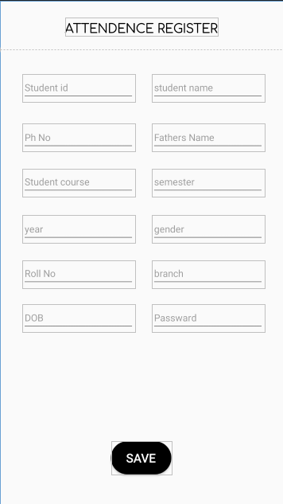
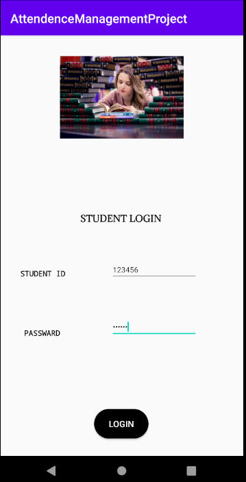
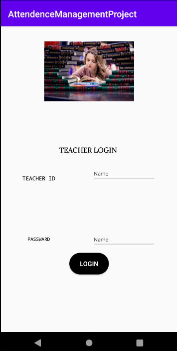

# attendence-management-system
<h1>This is android attendence management system.In this we perform sql crud operation to maintain attendence of students.In this app we have admin panel who can add teachers
,Teachers panel who can add students and take attendence of students and student view ,In this student can view his or her attendence</h1>

